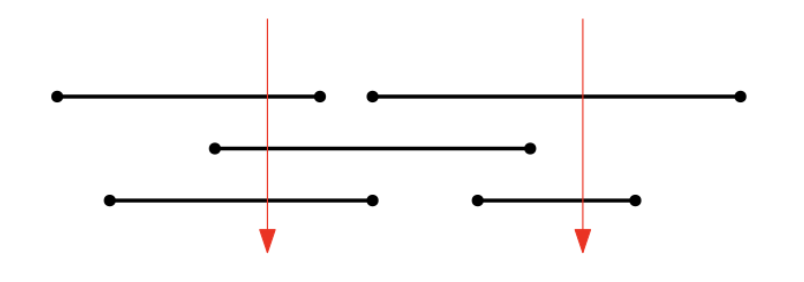
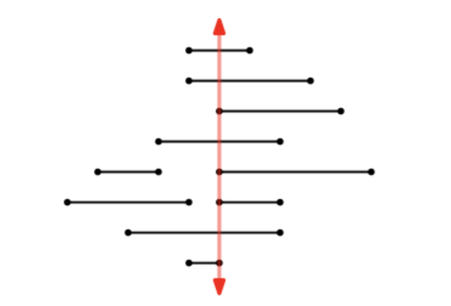

# [#1] 못 박기 (Pinning)

아래 그림처럼 `n`개의 막대가 입력으로 주어질 때, `n`개의 막대를 최소 개수의 못(pin)으로 꽂으려 한다. 모든 막대는 최소 하나 이상의 못이 박혀야 한다. 이 때, 필요한 핀의 최소 개수는 몇 개일까?

- 아래 그림에서는 `2`개의 못으로 모두 꽂을 수 있다.
- 못이 막대의 끝을 통과하더라도 꽂은 것으로 한다.



* **입력**: 첫 줄에는 막대의 갯수 `n`이 주어진다. 둘째 줄부터 `n`개의 막대의 왼쪽 끝 점 `a`와 오른쪽 끝 점 `b`의 좌표값이 차례대로 주어진다. 이 두 값의 범위는 `0` 이상 `200,000`이하이며 항상 `a < b`이다. 
* 이 때 `n`개의 막대에 대해 최소 개수의 못(pin)으로 꽂으려 하는데 모든 막대는 최소 하나 이상의 못이 박혀야 한다. 
* 못이 막대의 끝을 통과하더라도 꽂은 것으로 한다. 
* 동일한 끝 점을 갖는 구간이 두 개 이상 나타날 수 있다.
* **출력**: 최소 못의 개수
* **주석**: 자신의 알고리즘을 간략히 설명하고, 수행시간을 분석하라.


## 코드

```python
"""
1. 막대 정렬은 O(n log n)의 시간이 소요됩니다.
2. 막대의 정렬된 순서를 기준으로 반복문을 수행하며 못을 꽂는 과정에서 매 반복마다 상수 시간의 연산을 하므로 O(n)의 시간이 소요됩니다.
3. 따라서 아래 알고리즘의 전체 수행 시간은 O(n log n)입니다.
"""

def find_minimum_pins(n, bars):
	bars.sort(key=lambda x: x[1])  # 막대를 오른쪽 끝 좌표(x[1])를 기준으로 오름차순 정렬
	pins = []  # 못의 위치를 저장할 리스트
	max_right = -1  # 현재까지의 막대의 오른쪽 끝 위치 중 가장 큰 값

	for i in range(n):
			left, right = bars[i]  # 막대의 왼쪽 끝과 오른쪽 끝 좌표
			if left > max_right:  # 현재 막대가 이전 막대의 오른쪽 끝 위치보다 오른쪽에 있으면
					pins.append(right)  # 오른쪽 끝 위치에 못을 꽂음
					max_right = right  # 가장 오른쪽에 있는 막대의 오른쪽 끝 위치를 갱신
	return len(pins)

n = int(input())
bars = []
for _ in range(n):
	a, b = map(int, input().split())  # 막대의 왼쪽 끝과 오른쪽 끝 좌표
	bars.append((a, b))

print(find_minimum_pins(n, bars))

```

<br>


# [#2] 못 하나로 관통할 수 있는 막대의 최대 개수 구하기

이번에는 `n`개의 막대가 입력으로 주어질 때, 오직 하나의 못(pin)만을 사용해 가능하면 많은 개수의 막대를 꽂으려고 한다. 아래 그림에서는 붉은색 위치에 핀을 꽂으면 8개의 막대까지 꽂을 수 있다.

여러분은 하나의 핀만으로 꽂을 수 있는 최대 막대 수를 계산해 출력해야 한다.

* **주의**: 못이 막대의 끝을 통과하더라도 꽂은 것으로 간주한다.
* 아래 그림은 두 번째 샘플 테스트 케이스를 그린 것이다.
* 못이 막대의 여러 끝 점을 지날 수도 있기에 이런 예외적인 경우를 주의해서 구현해야 한다.



* **입력**: 첫 줄에는 값 `n`이 주어진다 (`1` 이상 `100,000` 이하). 둘째 줄부터 `n`개의 막대의 왼쪽 끝 점 `a`와 오른쪽 끝 점 `b`의 좌표 값이 차례대로 주어진다. 이 두 값의 범위는 `0` 이상 `200,000` 이하이며 항상 `a < b` 이다.  
* **출력**: 한 개의 못으로 꽂을 수 있는 최대 막대 개수
* **주석**: 자신의 알고리즘을 간략히 설명하고, 수행 시간을 분석하라.


## 코드

```python
"""

겹치는 선분의 개수를 찾는 방식으로 접근했습니다.

1. 입력된 선분들을 시작 좌표를 기준으로 오름차순으로 정렬합니다.
2. 가장 첫 번째 선분을 min heap에 넣습니다. min heap에는 (오른쪽 끝 좌표, 시작 좌표) 형태로 저장됩니다.
3. 배열의 첫 번째 선분부터 마지막 선분까지 반복하면서 겹침을 계산합니다.
4. 현재 선분과 min heap에 저장된 선분들을 비교하여 겹치는 선분들을 count합니다. 겹치지 않는 선분은 min heap에서 제거합니다.
5. 현재 선분을 min heap에 추가하고, 겹친 선분들의 개수를 업데이트합니다.
6. 모든 선분에 대한 반복이 끝나면 최대 겹침 개수를 출력합니다.

선분의 개수를 n이라고 할 때, 선분들을 정렬하는 데 O(nlogn) 시간이 소요됩니다. 
그리고 각 선분에 대해 min heap을 조작하는데 worst case 경우에는 OnlogN) 시간이 소요됩니다. 따라서, 이 알고리즘의 총 시간 복잡도는 O(nlogn)입니다.

"""

import sys
import heapq

input = sys.stdin.readline

n = int(input())
array = [tuple(map(int, input().split())) for _ in range(n)]
array.sort(key=lambda x: x[0])

min_heap = []
heapq.heappush(min_heap, (array[0][1], array[0][0]))
result = 1

# 겹치는 부분을 계산하는 함수
def calculate_overlap(segment):
	start, end = segment
	overlap_count = 0

	for right_end, left_start in min_heap:
			if right_end >= start:  # 현재 선분과 겹치는 경우
					overlap_count += 1
			else:  # 겹치지 않는 경우
					heapq.heappop(min_heap)

	heapq.heappush(min_heap, (end, start))  # 현재 선분을 min heap에 추가
	return overlap_count + 1  # 현재 선분도 겹치는 부분에 포함되므로 +1

for segment in array[1:]:
	overlap = calculate_overlap(segment)
	result = max(result, overlap)

print(result)
```

